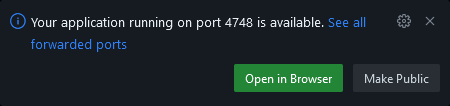

# Runner codespace

Provides a Codespace that can be used to browse files and get a shell on a GitHub actions runner.

## Usage

This project can be used together with:

- [https://github.com/dlemstra/github-actions-debugger](https://github.com/dlemstra/github-actions-debugger)

More information about that action can be found in the [Readme.md](https://github.com/dlemstra/github-actions-debugger) of that project.

## Start a shell on a runner from this codespace

This project can also be used to start a shell on an GitHub actions runner. The first step is to start a codespace for this project.
Once the codespace is started you can start a shell on a runner by running one the following command:

- start-ubuntu-20
- start-ubuntu-22
- start-ubuntu-22-arm
- start-ubuntu-24
- start-ubuntu-24-arm
- start-macos-12
- start-macos-13
- start-macos-14
- start-windows-2022

These commands will start a workflow in this project and that require the following secrets to be set in the repository:

`TOKEN_FOR_ACTIONS`: GitHub token with the following permissions: _Full control of private repositories (repo)_.

This action will start a workflow that will start a runner and tries to connect to codespace of this project. This action requires a secret token with the following name:

`TOKEN_FOR_CODESPACES`: GitHub token with the following permissions: _Full control of codespaces (codespace)_.

Once the runner is connected to the codespace you will see the following message in the codespace;



The command that you used to start the runner will also wait for the runner to connect to the codespace. Once the runner is connected a shell will be started on the runner.

```console
/workspaces/runner-codespace # start-ubuntu
Starting runner for ubuntu
Waiting for port 4748 to open |
Warning: Permanently added '[localhost]:4748' (ED25519) to the list of known hosts.
runner@fv-az1766-921:~/work/runner-codespace/runner-codespace$ uname -a
Linux fv-az1766-921 6.8.0-1014-azure #16~22.04.1-Ubuntu SMP Thu Aug 15 21:31:41 UTC 2024 x86_64 x86_64 x86_64 GNU/Linux
runner@fv-az1766-921:~/work/runner-codespace/runner-codespace$
```

When you exit the shell of the runner you can go back to the shell of the codespace by running the `shell` command:

```console
runner@fv-az1766-921:~/work/runner-codespace/runner-codespace$ exit
logout
Connection to localhost closed.
/workspaces/runner-codespace # shell
Warning: Permanently added '[localhost]:4748' (ED25519) to the list of known hosts.
runner@fv-az1766-921:~/work/runner-codespace/runner-codespace$
```

### Stop the runner that is connection to the codespace

Once you are done with the runner you can disconnect from the runner by running the `exit` command. You can then stop the runner by running the `stop-runner` command:

```console
runner@fv-az1766-921:~/work/runner-codespace/runner-codespace$ exit
logout
Connection to localhost closed.
/workspaces/runner-codespace # stop-runner
/workspaces/runner-codespace #
```

### Stop the codespace of this project

Once you are done with the codespace of this project you can stop it by running the `stop-codespace` command:

```console
/workspaces/runner-codespace # stop-codespace
/workspaces/runner-codespace #
```
